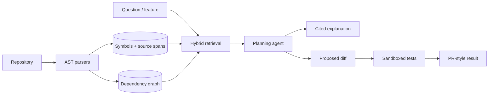

# CodePilot

CodePilot is a repository-level software engineering agent. It parses source code into symbols and dependency edges, retrieves evidence across the codebase, returns file-and-line citations, plans cross-file feature changes, and delegates tests to a constrained runner.



## Capabilities

- Python AST plus Tree-sitter parsers for TypeScript, JavaScript, Go, and Java
- Function, class, interface, method, module, import, and exact source-span indexing
- Hybrid ranking across lexical overlap, symbol matches, and dependency-graph centrality
- Repository answers and change plans with exact `path:start-end` citations
- Dependency graph API for architecture exploration
- Go test runner with path confinement, timeouts, output limits, read-only filesystem, dropped capabilities, and resource limits
- FastAPI/PostgreSQL backend, Redis deployment scaffolding, Next.js interface, Docker Compose, Kubernetes, AWS, and CI

## Run

```bash
cp .env.example .env
mkdir -p workspace
git clone https://github.com/example/project workspace/project
docker compose up --build
```

Index the mounted project:

```bash
curl -X POST http://localhost:8000/api/repositories -H 'Content-Type: application/json' -d '{"name":"project","path":"/workspace/project"}'
```

Ask a cited question with `POST /api/repositories/{id}/query`, create a feature plan with `/plan`, inspect `/graph`, or execute a bounded command through `POST /api/test-runs`. Open [http://localhost:3000](http://localhost:3000) and API docs at [http://localhost:8000/docs](http://localhost:8000/docs).

## Grounding contract

Every response separates generated text from evidence. Citations contain repository-relative paths and parser-derived line ranges. Retrieval-only mode works without an API key. Set LLM_API_KEY to enable the LangChain chat integration for explanations, plans, and proposed unified diffs. Model calls send retrieved source to the configured provider. Without a key, the system returns retrieved evidence only.

## Safety and limitations

The Compose sandbox demonstrates process, path, time, and resource controls; containers are not a complete boundary for hostile code. Production execution should create a fresh Firecracker VM or gVisor pod per run, deny network access, use ephemeral filesystems, enforce syscall policies, and destroy the environment after collecting bounded artifacts.

The current hybrid ranker uses lexical and structural signals. Production deployments should add code embeddings in pgvector, reranking, incremental indexing keyed by Git object IDs, resolved call graphs, and evaluation sets for citation recall, faithfulness, patch acceptance, and test quality. See [architecture](docs/architecture.md), [evaluation](docs/evaluation.md), and [security](docs/security.md).

## Current scope

The dashboard is wired to repository indexing, questions, plans, dependency views, and diff proposals. Source is connected through a mounted /workspace directory; GitHub OAuth and ZIP upload are not implemented. Diff proposals are not automatically applied or tested. The runner is a trusted-development tool, not a per-run hostile-code sandbox. Dense embeddings, asynchronous indexing, authentication, Redis caching, and automated patch validation remain future work. Do not expose this development deployment publicly.
